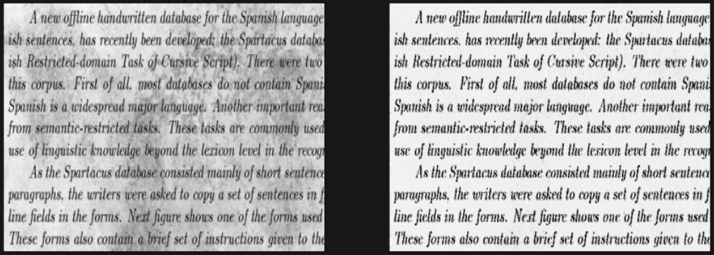

# DenoisingDirtyDocuments
### Document denoising using Autoencoder

### Basic information:
- Pytorch.
- ["Dataset"](https://www.kaggle.com/c/denoising-dirty-documents).
- Training took approximately 30 min for 100 epochs. Input shape (1, 540 , 420).

### Architecture:

### Results
